# Evolution-Creation

A reproducible Python project for testing quantitative claims raised in a debate about evolution, creation, human genealogy, migration, and genetic ancestry.

**Debate source:** [Evolution and Creation debate on YouTube](https://www.youtube.com/watch?v=hsJ-zLVn0H0)

The **Claim from the debate** statements below are concise paraphrases, not verbatim quotations. Each model now includes a **Speaker attribution** line based on the transcript. A machine-readable audit is available in [`data/debate_claim_attribution.json`](data/debate_claim_attribution.json). Where a model combines a claim and an objection, or synthesizes several exchanges, that is stated explicitly rather than assigning the synthesized sentence to one speaker. The **Judgment on the claim** sections distinguish mathematical possibility, model-dependent probability, and historically supported inference.


The project does **not** assume that a theological or historical claim is true. Each model is framed conditionally:

> Given a stated set of assumptions, what follows mathematically or computationally?


## Interactive synthesis: continental founder-spread explorer

This is **not Model 16**. It is a user-facing synthesis of the genealogy, migration, endogamy, historical-constraint, Tasmania, and admixture models.

[](https://colab.research.google.com/github/vafaei-ar/Evolution-Creation/blob/main/notebooks/interactive_continental_explorer.ipynb)

### What the user can change

The explorer now supports:

- founder date, generation interval, founder region, and number of initial joint children;
- date-responsive regional population presets, with every population editable;
- a complete destination × source parental-source matrix;
- region-specific mixing/endogamy;
- late-contact timing and migration multiplier;
- **Tasmania as a separate seventh node** with an explicit hard Australia/Oceania ↔ Tasmania barrier;
- deterministic or **finite-population Monte Carlo** mode;
- 25–500 stochastic replicates and reproducible random seed;
- map color for either-founder genealogy, both-founder genealogy, or mean founder-pair autosomal DNA;
- built-in scenario presets;
- **Scenario A vs Scenario B comparison**;
- automatic diagnosis of the limiting region or hard barrier;
- JSON export of the exact scenario.

The seven modeled nodes are Middle East, Africa, Europe, Asia, Americas, Australia/Oceania, and Tasmania.

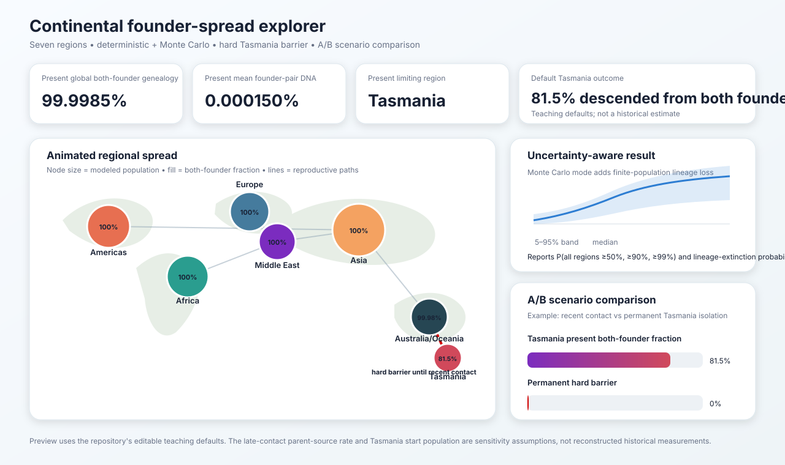

### Why Tasmania is separate

The debate itself treats isolation as a decisive stress test. A continent-scale Oceania node hides that issue.

The explorer therefore represents Tasmania separately. By default, the Australia/Oceania ↔ Tasmania reproductive edge is a **true zero barrier** until the selected recent-contact release date. A permanent-barrier toggle lets the user see the hard topological result directly: if no reproductive path ever opens, outside founder ancestry cannot enter Tasmania.

The land-bridge/contact chronology is evidence-constrained; the **post-contact parent-source rate is not**. It remains an editable sensitivity assumption.

### Population defaults

The founder default remains 11,000 years ago, approximately 9000 BCE. The continental teaching preset uses the same coarse historical regional series as before.

Tasmania is treated differently: the repository does not contain a defensible Tasmania-specific population estimate for 11 ka. Its default start population is therefore explicitly marked as a **teaching placeholder**, using 7,465 because that is the middle early-contact population model stored in Model 10. It must not be interpreted as a 9000 BCE estimate.

When auto-population mode is enabled, continental start populations change with the selected founder date by log-interpolating the stored 1000-year anchors. This is a visualization/modeling convenience, not additional archaeological evidence.

### Deterministic versus Monte Carlo

Deterministic mode shows expected pedigree-state fractions.

Monte Carlo mode samples finite regional populations each generation, so the user can see:

- early founder-lineage extinction;
- stochastic variation after rare reproductive migration;
- 5th–95th percentile uncertainty bands;
- probability all seven regions exceed 50%, 90%, or 99% both-founder descent;
- probability the founder lineage disappears.

These are **conditional probabilities under the selected parameters**, not posterior probabilities that the historical scenario occurred.

### Better visual explanation

The redesigned notebook uses a coordinated dashboard:

1. animated world map with population-scaled nodes;
2. regional both-founder trajectories;
3. global deterministic trajectory plus Monte Carlo 5–95% band;
4. present regional genealogy versus mean founder DNA;
5. regional population trajectories on a log scale;
6. parental-source heatmap;
7. A/B scenario comparison.

The automatic diagnosis also reports the limiting region, identifies regions with no reproductive path, and states which region crosses the selected universal-ancestry threshold last.

### Reproducibility

The current scenario can be exported as JSON. This makes statements such as “this parameterization reaches universal ancestry” independently rerunnable rather than dependent on screenshots or prose.

### Interpretation

A successful run means only:

> Under these selected population, migration, mating, barrier, and timing assumptions, universal founder genealogy is compatible with the model.

It does **not** mean those parameter values occurred historically.

The explorer is intentionally designed so users can lower migration, strengthen endogamy, permanently isolate Tasmania, change founder timing, or compare two scenarios and see exactly which assumption changes the conclusion.

Population and Tasmania constraints are documented in [the explorer documentation](docs/interactive_continental_explorer.md).

## Model 01: spread of a genealogical founder

### Claim from the debate

**Speaker attribution:** Mr. Kamkar advances the one-migrant/genealogical-spread argument; Dr. Vahdati-Nasab challenges how a tiny lineage could catch a much larger population.

A single person entering a much larger population can, through ordinary intermarriage, eventually become a genealogical ancestor of essentially everyone; the founder lineage should not be treated as a permanently separate clan competing numerically with the rest of the population.


The baseline asks:

> If one individual enters a finite, completely mixed population and reproduces within it, how does that individual's genealogical ancestry spread through later generations?

It assumes fixed population size, non-overlapping generations, two parents per child, random mating, no geography, no migration, no selection, and no genetics.

[](https://colab.research.google.com/github/vafaei-ar/Evolution-Creation/blob/main/notebooks/01_founder_spread.ipynb)

Under the infinite-population deterministic approximation:

$$
f_{t+1}=1-(1-f_t)^2.
$$

The stochastic simulation samples parents explicitly, so rare founder lineages can disappear by chance.

### Judgment on the claim

**Supported as a mathematical possibility, but not guaranteed.** In a completely mixed neutral population, genealogical descendant status can spread rapidly because every mating between a descendant and a non-descendant creates children who are descendants of the founder. The model therefore supports the core point that a founder who begins as a tiny fraction of the population can eventually become universal.

The important qualification is early stochastic extinction: a founder can leave no continuing lineage before the deterministic spread regime is reached. Model 01 therefore does **not** assign a historical probability to any particular ancient founder.

**What must be corrected to make the historical claim stronger:** specify the real mating structure, reproductive success, population size, and whether the founder lineage survived its first few generations. A panmictic toy population establishes possibility, not historical occurrence.

## Model 02: structured populations and migration

### Claim from the debate

**Speaker attribution:** Mr. Kamkar argues that even very small nonzero migration can carry the lineage into Australia or the Americas.

Even when human populations are geographically structured, rare migration can carry a founder lineage into distant populations; therefore a very small but nonzero migration rate may be enough for ancestry to spread widely.


Model 02 removes the strongest unrealistic assumption from Model 01: complete mixing.

The population is divided into demes. For a child born in deme $i$, the migration matrix entry $M_{ij}$ is the probability that a parent is sampled from source deme $j$. This is an abstraction of parental-source mixing or gene flow.

[](https://colab.research.google.com/github/vafaei-ar/Evolution-Creation/blob/main/notebooks/02_structured_migration.ipynb)

### Example trajectory

The figure below uses five equal demes in a line, one founder population at the left edge, and a total nearest-neighbor migration rate of 0.02 per parental draw.


The parameter values above are illustrative. They are **not** estimates of ancient human migration.

### Sensitivity to migration and elapsed time

The next figure estimates the probability that founder ancestry has fixed in all four demes by the stated generation. It uses 30 stochastic replicates per cell.


At migration rate zero, the founder lineage cannot cross between demes. With nonzero connectivity, elapsed time and migration rate jointly control whether the lineage spreads through the entire system.

### Animated ancestry front

The generated SVG below animates one stochastic run across seven demes.


Model 02 also has a hard-barrier control. A permanent barrier makes the migration matrix block-disconnected. If the founder starts on one side, ancestry cannot reach the other side regardless of how many generations pass.

### Judgment on the claim

**Conditionally supported.** Model 02 confirms that nonzero reproductive connectivity can spread founder ancestry across demes, while a permanent zero-migration barrier makes spread across that barrier exactly impossible.

The phrase "the migration rate was nonzero" is therefore scientifically incomplete. A rate can be positive yet too small, too late, or too geographically restricted to produce universal ancestry by a specified deadline.

**What must be corrected to satisfy the stronger claim:** provide a time scale and a defensible migration / parental-source matrix, and show that every present-day population is connected by at least one reproductive path with enough generations for the lineage to spread. Nonzero connectivity alone is not a probability estimate.

## Model 03: time-varying connectivity

### Claim from the debate

**Speaker attribution:** Exchange between both speakers. Dr. Vahdati-Nasab raises long isolation as an objection; Mr. Kamkar responds that barrier timing and whether ancestry crossed before or after isolation are what matter.

Historical isolation does not automatically rule out shared genealogy. What matters is whether founder ancestry crossed into a population before a barrier closed, or whether later contact reopened a reproductive path.


Model 03 allows migration barriers to appear or disappear over time.

[](https://colab.research.google.com/github/vafaei-ar/Evolution-Creation/blob/main/notebooks/03_time_varying_connectivity.ipynb)

This distinction is important:

- a population isolated from the start cannot receive founder ancestry across the barrier;
- a population that becomes isolated later may already contain that ancestry;
- reopening a route can restart spread after a period of isolation.

### When does isolation begin?

The figure below varies the generation when a permanent barrier appears. The final-generation fixation probability changes strongly with both migration rate and barrier timing.


These are small illustrative simulations. The plotted probabilities include Monte Carlo error and are not historical estimates.

### Same barrier, different histories

The barrier in these scenarios is between Deme 3 and Deme 4.


A barrier present from generation 1 keeps the right component free of founder ancestry. Closing the same barrier later can give a completely different result because ancestry may already have crossed.

### Animation: isolation after ancestry crosses

In this run, the barrier closes at generation 20. Founder ancestry has already entered Deme 4. After isolation, ancestry continues spreading inside the now-separated right component.


### Judgment on the claim

**Supported.** The timing of isolation is a genuine causal variable. If a barrier is present before founder ancestry arrives, ancestry cannot cross it. If the same barrier closes only after ancestry has entered, descendants can continue spreading within the newly isolated component. Reopening later can restart exchange.

**What must be corrected in historical arguments:** replace statements such as "this population was isolated" with a dated sequence: when did the founder lineage exist, when was the reproductive route open, when did it close, and did it later reopen? The ordering of those events can reverse the conclusion.

## Model 04: population growth, carrying capacity, and overlapping ancestry

### Claim from the debate

**Speaker attribution:** Exchange between both speakers. Dr. Vahdati-Nasab raises the competing-exponential-populations objection; Mr. Kamkar responds that intermarriage means the non-founder population must remain 'pure' to stay outside the founder genealogy.

The objection that "one founder lineage can never catch a much larger native population because both groups reproduce exponentially" is misleading once intermarriage occurs: descendants of the founder and descendants of the original population become overlapping sets.


Model 04 addresses a common intuition trap: treating "descendants of the founder" and "descendants of everyone else" as two disjoint populations that each grow exponentially.

After intermarriage, those descendant sets overlap. A person can be descended from both the founder and members of the original background population.

[](https://colab.research.google.com/github/vafaei-ar/Evolution-Creation/blob/main/notebooks/04_demography_carrying_capacity.ipynb)

Under neutral random mating,

$
f_{t+1}=1-(1-f_t)^2
$

still governs the expected founder-descendant fraction even when total population size changes. Demography changes absolute descendant counts and finite-population extinction risk, but not this infinite-population neutral fraction recurrence.

### Growth and carrying capacity

The upper panel below compares constant, exponential, and logistic population-size schedules. The lower panel shows the same expected genealogical ancestry fraction for all three because they begin with the same founder fraction.


### Why two exponential lineages are the wrong picture

The next figure separately tracks descendants of the founder group, descendants of the original background group, and people descended from both.


Once intermarriage occurs, "founder descendants" and "background descendants" are overlapping sets, not mutually exclusive clans.

### Animated overlap


The notebook also lets you introduce logistic carrying capacity, temporary bottlenecks, and a relative reproductive-weight sensitivity parameter. These are conceptual experiments, not estimates of prehistoric demography.

### Judgment on the claim

**The "two separate exponential lineages" objection is rejected under ordinary intermarriage.** Once a founder descendant has children with members of the background population, "founder descendants" and "background descendants" are no longer mutually exclusive populations. The same person can belong to both sets. Under neutral random mating, population growth or carrying capacity changes absolute counts but does not by itself prevent the founder-descendant fraction from spreading according to the ancestry recurrence.

**What would make the objection valid:** sustained reproductive separation, strong assortative mating, or strong differential reproductive success that keeps the two descendant sets close to disjoint. Merely observing that both groups reproduce does not block genealogical takeover.

## Model 05: endogamy and assortative mating

### Claim from the debate

**Speaker attribution:** Dr. Vahdati-Nasab raises isolated/endogamous populations as a serious objection; Mr. Kamkar explicitly acknowledges Tasmania and the Samaritans as cases requiring the simple model to be revised.

Highly endogamous or historically isolated communities, such as the examples raised in the debate, may be important counterexamples to a recent universal genealogical-ancestor claim because reproductive isolation can prevent an outside lineage from entering.


Model 05 replaces purely geographic barriers with persistent **social mating structure**.

[](https://colab.research.google.com/github/vafaei-ar/Evolution-Creation/blob/main/notebooks/05_endogamy_assortative_mating.ipynb)

An endogamy strength of 0 means mate communities are sampled according to population size, while 1 means perfect within-community mating. Perfect endogamy is therefore a true reproductive barrier even if communities are geographically adjacent.

### Endogamy slows cross-community spread

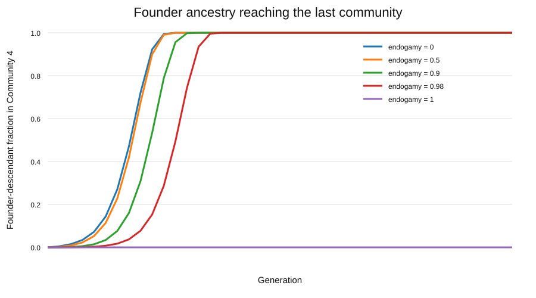

As endogamy approaches 1, the time required for founder ancestry to penetrate other communities can become much longer. At exactly 1, other communities are unreachable.

### Endogamy plus assortative mating

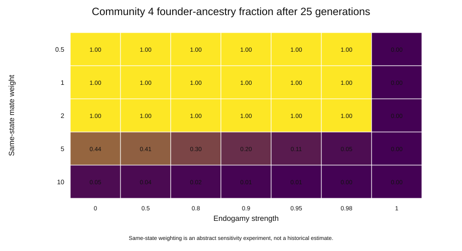

The vertical axis is an abstract same-state mate-choice weight. It is included as a sensitivity analysis only. Deep genealogical ancestry itself is not assumed to be observable.

### Animated high-endogamy example

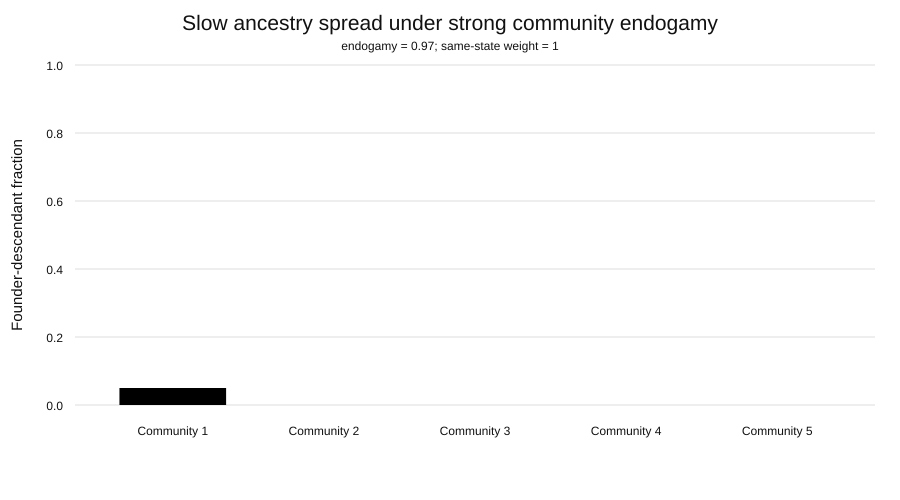

The model distinguishes **perfect isolation** from **rare bridging marriages**. A single cross-community genealogical bridge can seed ancestry inside an otherwise highly endogamous community, after which within-community reproduction can propagate it.

### Judgment on the claim

**The objection is valid only at the limit of complete reproductive isolation.** Perfect endogamy creates disconnected pedigree components, so a founder outside a component can never become a genealogical ancestor inside it. With incomplete endogamy, even rare bridging marriages can seed founder ancestry, although the time to spread can become much longer.

**What the universal-ancestor claim must show:** not simply geographic proximity, but at least one effective reproductive bridge into every relevant community, followed by enough within-community reproduction. For historical groups cited as endogamous, the decisive quantity is cross-group parentage through time, not the label "endogamous" by itself.

## Model 06: genealogical MRCA and the Identical Ancestors Point

### Claim from the debate

**Speaker attribution:** Mr. Kamkar introduces the recent genealogical MRCA and Identical Ancestors Point argument, citing the Douglas Rohde modeling; Dr. Vahdati-Nasab disputes its applicability to real human population history.

Genealogical common ancestry can be dramatically more recent than genetic coalescence. A most recent genealogical common ancestor, and later an Identical Ancestors Point, can occur only thousands of years in the past even though genetic lineages trace much deeper.


Model 06 traces complete two-parent pedigrees **backward** from the present generation.

- The genealogical **MRCA** is the first past generation containing at least one person who is an ancestor of everyone in the present population.
- The **Identical Ancestors Point (IAP)** is farther back: every person in that generation who has any present-day descendants is an ancestor of everyone in the present population.

The IAP is a time threshold, not a single ancestor.

[](https://colab.research.google.com/github/vafaei-ar/Evolution-Creation/blob/main/notebooks/06_mrca_iap.ipynb)

### Exact finite pedigree

Each past individual is classified as having no present descendants, being a partial ancestor, or being a universal ancestor. The first universal ancestor marks the MRCA; the disappearance of all partial ancestors marks the IAP.

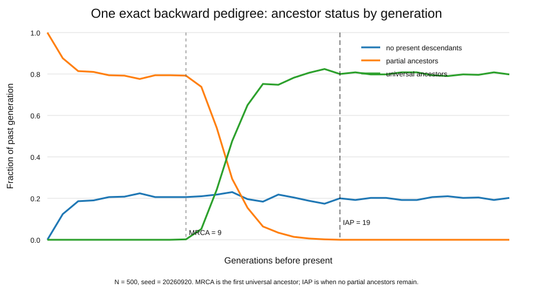

### Chang random-mating benchmark

For Chang's idealized constant-size two-parent model, the large-population benchmarks are

```math
T_{MRCA}\approx\log_2N
```

and

```math
T_{IAP}\approx1.77\log_2N
```

The exact finite simulations approach these only gradually.

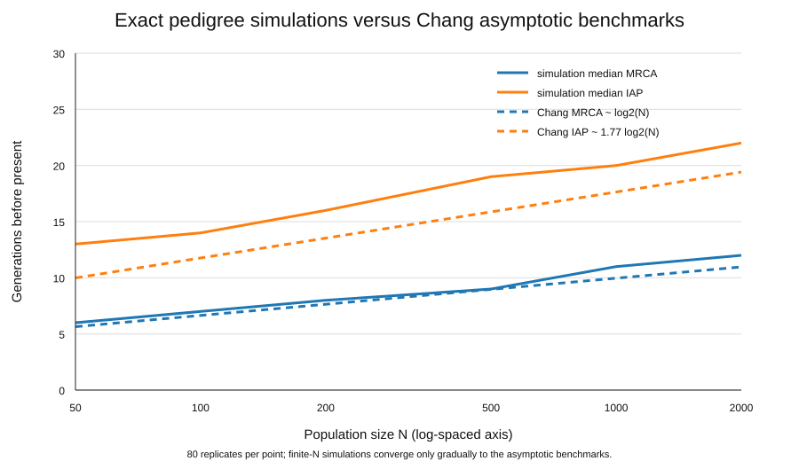

These equations are asymptotic results for an idealized random-mating population. They are not historical dates for humanity.

### Population structure

The structured extension interpolates between population-size-proportional panmixia and complete within-community isolation.

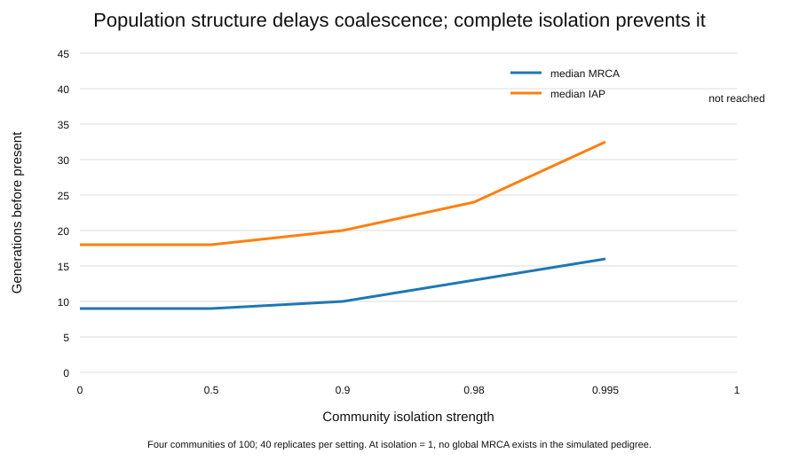

Near-complete isolation can substantially delay MRCA and IAP. At complete persistent isolation, a global MRCA is impossible across disconnected present-day communities.

### Animated backward pedigree

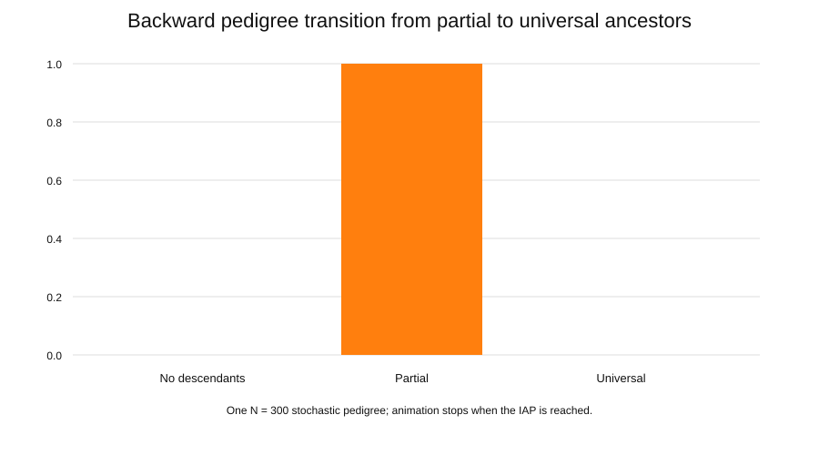

This is genealogical ancestry only. A genealogical common ancestor does not imply that detectable DNA from that ancestor survives in every present-day descendant. Chromosomal inheritance is reserved for Model 07.

Primary references:

- Joseph T. Chang (1999), Recent common ancestors of all present-day individuals, Advances in Applied Probability 31(4), 1002-1026. https://doi.org/10.1239/aap/1029955256
- Douglas L. T. Rohde, Steve Olson, and Joseph T. Chang (2004), Modelling the recent common ancestry of all living humans, Nature 431, 562-566. https://doi.org/10.1038/nature02842

### Judgment on the claim

**The core genealogical claim is supported; the specific historical date is not established by this model alone.** Chang-style random-mating pedigrees do produce MRCA times on the order of \(\log_2 N\) generations and an Identical Ancestors Point later than the MRCA. This confirms that genealogical ancestry can collapse far more recently than genetic lineages.

However, applying an ideal panmictic result directly to all humans ignores migration barriers, endogamy, changing population size, and geography. Thus genetic dates of tens or hundreds of thousands of years do **not** by themselves refute a much more recent genealogical MRCA, but neither does the idealized MRCA model prove that an 11 ka global ancestor actually existed.

**What must be corrected to make the 11 ka claim historical rather than mathematical:** embed the MRCA calculation in empirically constrained population structure and migration history, which is the purpose of Models 09 and 10.

## Model 07: genealogical ancestry versus autosomal genetic ancestry

### Claim from the debate

**Speaker attribution:** Mr. Kamkar argues that genealogical descent can persist after a particular ancestor contributes no genetic material to a distant descendant; Dr. Vahdati-Nasab challenges his simplified genetic explanation.

A person can be a genuine genealogical ancestor while leaving no identifiable autosomal DNA in a particular distant descendant. Therefore absence of detectable DNA from a proposed ancestor is not, by itself, proof that the genealogical relationship did not exist.


Model 07 adds chromosomes and recombination to the genealogical story.

A person can be a genuine genealogical ancestor of a descendant while contributing **zero autosomal DNA** to that descendant. The distinction becomes increasingly important as the number of generations grows.

[](https://colab.research.google.com/github/vafaei-ar/Evolution-Creation/blob/main/notebooks/07_genetic_ancestry.ipynb)

### Published single-ancestor benchmark

Using the human approximation described by Agranat-Tamir, Mooney, and Rosenberg (2024), following Coop (2013), the mean number of surviving autosomal fragments from one specified genealogical ancestor k generations back is

```math
\lambda_k=\frac{22+33(k-1)}{2^{k-1}}
```

for k >= 2. Approximating fragment count as Poisson gives

```math
p_k=1-e^{-\lambda_k},
```

the probability that the genealogical ancestor is also an autosomal genetic ancestor along that path.

The published examples are p_8 = 0.8615 and p_16 = 0.0157.

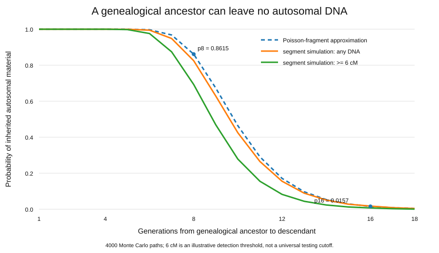

The green curve uses a 6 cM illustrative threshold. It asks a stricter question than whether **any** DNA survives. The repository does not treat 6 cM as a universal consumer-DNA detection cutoff.

### Genealogical slots versus genetic ancestors

Ignoring pedigree collapse, the number of genealogical pedigree slots grows as 2^k. The expected number that contribute autosomal DNA is 2^k p_k.

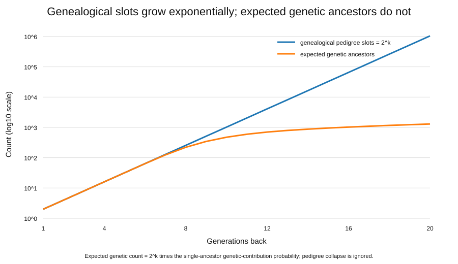

This is why dividing an assumed number of genes by 2^k is the wrong inheritance model. Genes are linked on chromosomes; meiosis transmits recombinant chromosome segments rather than independently sampling genes.

### Animated segment loss

The explicit segment simulator uses 22 autosomes and a transparent 33-Morgan aggregate map. The animation displays eight representative autosomes from one stochastic path.



Orange intervals are founder-derived segments. Recombination breaks them into smaller pieces, and stochastic transmission can eventually remove them completely.

### Important single-path limitation

The probability curve above follows **one specified genealogical path** from ancestor to descendant.

A distant real ancestor can appear in a pedigree through multiple paths because of pedigree collapse. Multiple paths can increase the chance that some DNA survives, and those paths are not generally independent. Therefore the single-path curve should not be used by itself to infer the genetic contribution of a proposed ancient universal genealogical ancestor.

That requires combining the Model 06 population pedigree with chromosome transmission across the full pedigree.

Real recombination also varies by genomic location, sex, population, and individual. Model 07 deliberately uses a transparent aggregate recombination model rather than claiming high-resolution historical realism.

Primary references:

- L. Agranat-Tamir, J. A. Mooney, and N. A. Rosenberg (2024), Counting the genetic ancestors from source populations in members of an admixed population, Genetics 226(4), iyae011. https://doi.org/10.1093/genetics/iyae011
- S. Gravel and M. Steel (2015), The existence and abundance of ghost ancestors in biparental populations, Theoretical Population Biology 101, 47-53. https://doi.org/10.1016/j.tpb.2015.02.002
- A. Kong et al. (2010), Fine-scale recombination rate differences between sexes, populations and individuals, Nature 467, 1099-1103. https://doi.org/10.1038/nature09525

### Judgment on the claim

**Supported for a specified genealogical path.** In the published approximation used here, a specified genealogical ancestor eight generations back has an autosomal-genetic-ancestor probability of about **86.15%** along that path. At 16 generations, that probability falls to about **1.57%**, corresponding to about a **98.43% probability of zero autosomal contribution along that single path**.

This directly supports the claim that genealogical ancestry and detectable genetic ancestry are different concepts. But pedigree collapse can give a distant ancestor multiple paths to the same descendant, increasing the chance that some DNA survives.

**What must be corrected in the strongest version of the claim:** "no detectable DNA" cannot be inferred from the single-path formula alone for a universal ancestor reached through many pedigree paths. Population-scale pedigree and recombination must be modeled jointly.

## Model 08: integrated pedigree + autosomal founder DNA

### Claim from the debate

**Speaker attribution:** Primarily a synthesis of Mr. Kamkar's genealogy-versus-genetics argument. The integrated pedigree-plus-recombination formulation is the repository's model, not a verbatim standalone claim from one speaker.

A founder pair could become genealogical ancestors of an entire population while their autosomal genetic contribution becomes absent in some descendants or too fragmented to be detectable, so genealogical universality does not require genetic universality.


Model 08 finally places genealogy and chromosome inheritance inside the **same finite population**.

For multiple founders, genealogy is tracked separately for each founder. Autosomal segments are tagged collectively as DNA from the founder set.

[](https://colab.research.google.com/github/vafaei-ar/Evolution-Creation/blob/main/notebooks/08_pedigree_genome.ipynb)

### Genealogical universality is not genetic universality

The representative run below uses a constant panmictic population of 500, two founders, distinct parents, a 6 cM illustrative threshold, and seed 3.

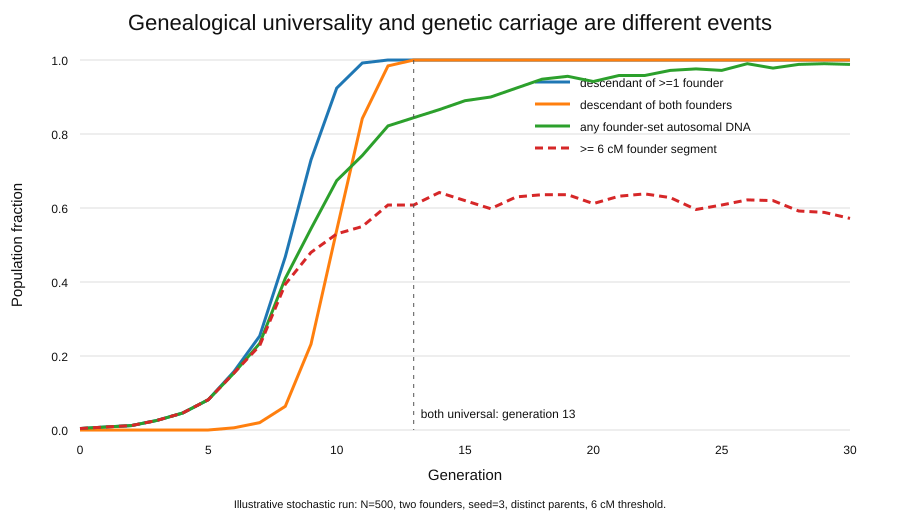

In this run, **both founders become genealogical ancestors of everyone at generation 13**. At that same generation, only 84.4% of the population carries any autosomal DNA from the founder set and 60.8% carries a founder-derived segment at least 6 cM long.

Those percentages are properties of this stochastic toy run, not estimates for real human history.

### What exists inside a universally descended population?

Once both founders are universal genealogically, individuals can still differ genetically.


At generation 13 of the example, 15.6% of the population is descended from both founders but carries no tagged autosomal DNA from either founder; 23.6% carries founder DNA only in segments below 6 cM; and 60.8% carries at least one segment at or above 6 cM.

Later generations do **not** simply show monotonic loss of founder DNA from every person. Because the founders reach individuals through many pedigree paths, tagged DNA can be redistributed to additional descendants even while recombination breaks it into smaller pieces.

### Animated joint state


Gray is the fraction not yet descended from both founders. Once that disappears, the entire population is genealogically descended from both founders, but genetic status still ranges from no founder DNA to sub-threshold or larger segments.

### Why this differs from the single-path model

Model 07 followed one specified ancestor-descendant path. Model 08 allows the same founder to reach a descendant through many pedigree paths.

The population-wide mean founder-DNA fraction is therefore a different quantity from the single-path expectation 2^-k. Under neutral Mendelian transmission its replicate-ensemble expectation is conserved, although any finite run can drift.

The model also distinguishes **descent from at least one founder** from the stronger condition **descent from every founder**. A founder lineage can disappear by chance before becoming universal.

The current genetic tag is collective: carrying founder DNA means carrying DNA from at least one member of the founder set. The model does not yet distinguish surviving DNA from founder 1 versus founder 2.

A complete population-level ghost event is recorded only if all founders are genealogically universal and all tagged founder-set autosomal DNA has disappeared from the population. Such an event is possible but is not guaranteed for a designated founder pair.

Primary references:

- L. Agranat-Tamir, J. A. Mooney, and N. A. Rosenberg (2024), Counting the genetic ancestors from source populations in members of an admixed population, Genetics 226(4), iyae011. https://doi.org/10.1093/genetics/iyae011
- S. Gravel and M. Steel (2015), The existence and abundance of ghost ancestors in biparental populations, Theoretical Population Biology 101, 47-53. https://doi.org/10.1016/j.tpb.2015.02.002
- A. Kong et al. (2010), Fine-scale recombination rate differences between sexes, populations and individuals, Nature 467, 1099-1103. https://doi.org/10.1038/nature09525

### Judgment on the claim

**Supported as a joint mathematical possibility, not as a historical probability.** In the representative \(N=500\), two-founder run, both founders become genealogical ancestors of everyone by generation 13. At that same generation, **15.6%** of the population carries no tagged autosomal DNA from the founder set, **23.6%** carries only sub-6-cM founder segments, and **60.8%** carries at least one founder-derived segment of 6 cM or larger.

So universal genealogy can coexist with heterogeneous or absent autosomal founder DNA in some descendants. However, the same run also shows that founder-derived DNA can remain common after genealogical universality; the model does **not** support the stronger statement that a universal founder pair should necessarily become genetically invisible.

**What must be corrected to test the historical Adam-and-Eve claim:** use realistic population structure and founder-specific genomic tagging over the actual historical time interval, rather than interpreting this small panmictic population as a reconstruction of human history.

## Model 09: historically constrained founder scenarios

### Claim from the debate

**Speaker attribution:** Mr. Kamkar advances the ~11 ka Adam/Eve plus later-migration scenario. Dr. Vahdati-Nasab raises Australia, the Americas, Tasmania, and absence of expected genetic evidence as objections.

If an Adam-and-Eve founder pair appeared roughly 11,000 years ago in West Asia, later migration and intermarriage could in principle spread their genealogy into already established populations in Australia and the Americas; Tasmania is a special hard-isolation case that must be handled separately.


Model 09 tests the debate's proposed **~11,000-year founder pair in West Asia** against time-dependent reproductive connectivity rather than against an unconstrained random-mating world.

[](https://colab.research.google.com/github/vafaei-ar/Evolution-Creation/blob/main/notebooks/09_historical_constraints.ipynb)

### Historical ordering matters

Sahul and the Americas were already populated long before 11 ka. Tasmania is especially important because archaeological syntheses place final Bassian land-bridge submergence around 12 ka, close to and under the default chronology **before** an 11 ka founder insertion.

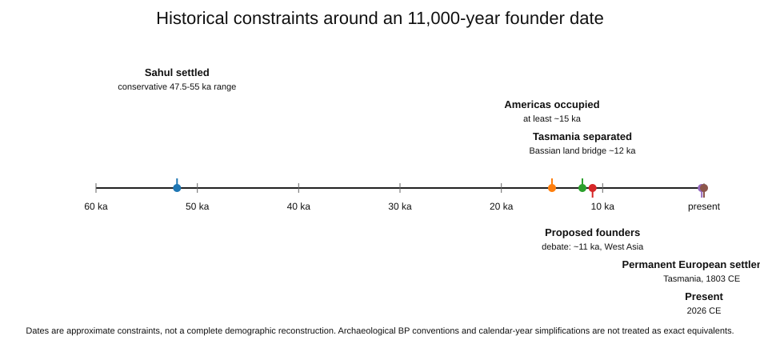

This means an 11 ka date does not automatically place the founders before Tasmanian isolation. The model therefore exposes the isolation date as a parameter.

### Two-founder regional genealogy

The default pedagogical scenario converts 11,000 years into 440 generations at 25 years per generation. It tracks founder A and founder B separately and can force a chosen number of first-generation joint children.

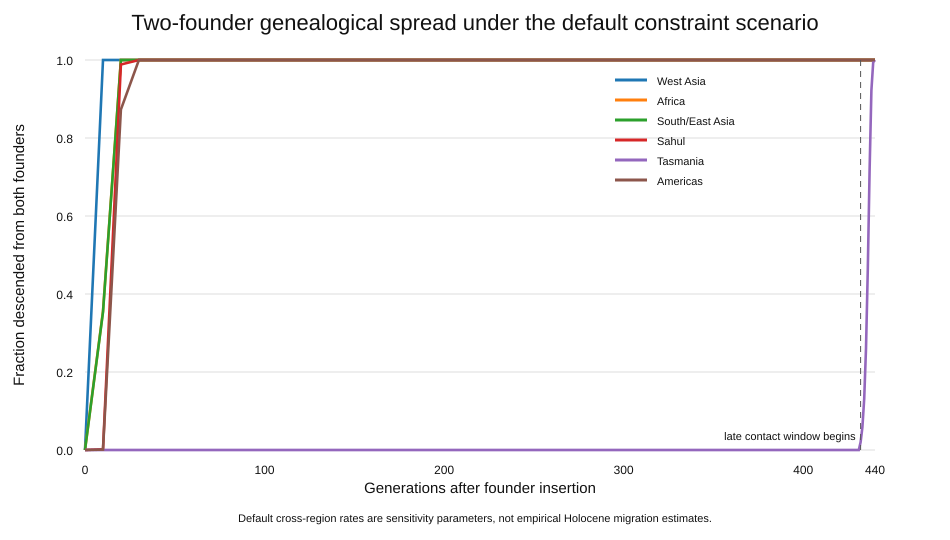

The non-Tasmanian cross-region rates in this plot are **sensitivity parameters, not empirical migration estimates**. In the default setup, Tasmania remains at zero founder ancestry until the late-contact window opens.

A zero reproductive path is a hard result: founder ancestry cannot enter that population. A positive path establishes only possibility, not probability.

### How much can late contact change?

To isolate the late-contact question, the next calculation deliberately favors the founder scenario: the external parent pool is assumed already 100% descended from both founders.

For a formerly isolated deme,

```math
f_{t+1}
=
1-
\left[(1-m)(1-f_t)\right]^2,
```

where $m$ is the external-parent probability per parental draw.

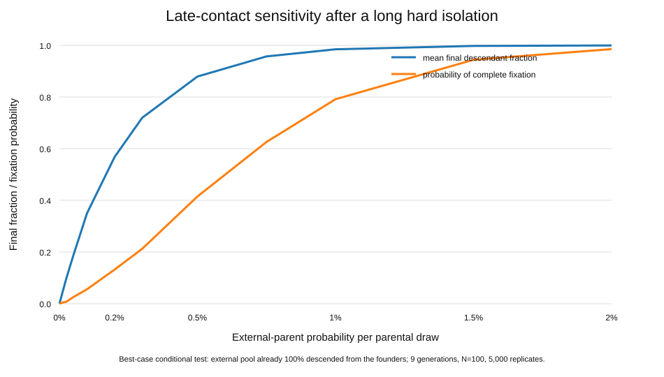

With nine generations, a finite $N=100$ simulation gives about:

- 0.1% external parents: 5.6% probability of complete fixation
- 0.5%: 41.5%
- 1%: 79.2%
- 2%: 98.6%

These values come from 5,000 Monte Carlo replicates and are **not historical estimates**.

### Animated late-contact window

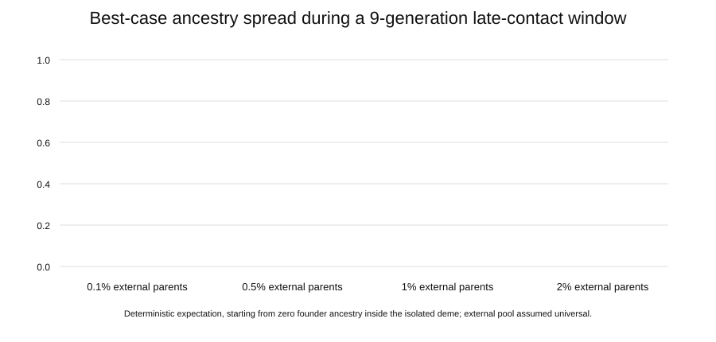

The key transition is conceptual: long isolation makes ancestry entry impossible while the barrier is closed; once it reopens, the question becomes how much effective reproductive mixing occurred during the remaining generations.

### Endogamy, bottlenecks, and chromosomes

Model 09 also includes:

- an endogamy parameter that scales cross-region parent-source probabilities toward zero;
- a region-specific bottleneck helper for demographic sensitivity;
- a finite stochastic two-founder simulation;
- an optional structured pedigree + chromosome diagnostic using the Model 08 recombination engine.

The chromosome mode confirms the same topological rule: if no reproductive path exists, neither genealogy nor founder DNA can enter.

Primary external constraints used in the documentation:

- Sandra Bowdler (2015), *The Bass Strait Islands revisited*, Quaternary International 385, 206-218.
- Fuller et al. (2023), *The archaeology of orality: Dating Tasmanian Aboriginal oral traditions to the Late Pleistocene*, Journal of Archaeological Science.
- Malaspinas et al. (2016), *A genomic history of Aboriginal Australia*, Nature 538, 207-214.
- Willerslev & Meltzer (2021), *Peopling of the Americas as inferred from ancient genomics*, Nature 594, 356-364.
- National Museum of Australia material on Tasmania's separation and permanent British settlement beginning in 1803.

### Judgment on the claim

**Impossible while a hard reproductive barrier is closed; conditionally possible after it reopens.** In the Model 09 late-contact experiment, which deliberately assumes the external population is already 100% descended from both founders, a formerly isolated \(N=100\) deme with nine generations remaining had approximately:

- **5.6%** probability of complete genealogical fixation at a 0.1% external-parent probability per parental draw;
- **41.5%** at 0.5%;
- **79.2%** at 1%;
- **98.6%** at 2%.

These are toy-model sensitivities, not estimates of Tasmanian history. The important result is that "some later contact occurred" does not by itself settle the claim: the probability changes from small to large over a relatively narrow range of effective reproductive mixing.

**What must be corrected to satisfy the 11 ka scenario:** demonstrate a reproductive path into every otherwise disconnected population and constrain its effective parentage rate and timing. For Tasmania in particular, later contact must do the work if the founder date is later than geographic isolation.

## Model 10: evidence-calibrated uncertainty envelopes

### Claim from the debate

**Speaker attribution:** Repository synthesis rather than a sentence stated by one speaker: it combines Mr. Kamkar's ~11 ka compatibility claim with Dr. Vahdati-Nasab's archaeological, isolation, and genetic objections.

After archaeological, demographic, and genetic constraints are included, an approximately 11 ka founder pair could still be compatible with universal present-day genealogical ancestry, provided enough later reproductive mixing occurred across the populations that were already established or isolated.


Model 10 asks a stricter question than Model 09: **which numerical inputs are actually supported by published evidence, and which decisive inputs remain unknown?**

[](https://colab.research.google.com/github/vafaei-ar/Evolution-Creation/blob/main/notebooks/10_evidence_calibration.ipynb)

A machine-readable evidence ledger is stored in `data/model10_evidence.json`. Every input is labeled as a debate assumption, direct quantitative evidence, published scenario-model output, historical date, qualitative constraint, or currently unconstrained parameter.

### Evidence changes the generation count

Published ancient-DNA estimates support a mean human generation interval around 26-30 years over the relevant timescale. An 11,000-year founder date therefore corresponds to roughly **367-423 generations**, rather than automatically using 440 generations from a 25-year convention.

### The direct Tasmania closure bracket gives no pre-closure window

The sea-level bracket used in Model 10 places the last continuous Bassian land bridge at approximately **11,960-12,890 years BP**.

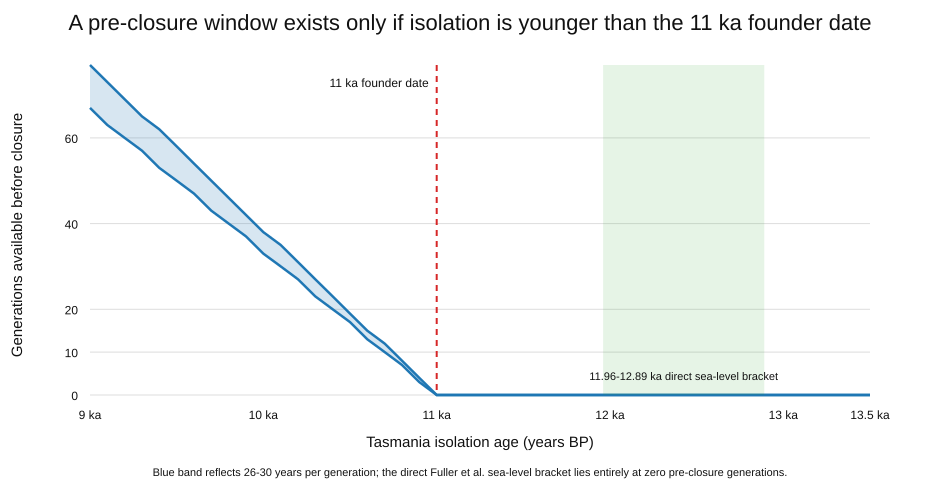

For a founder appearing outside Tasmania at 11 ka, the entire direct bracket places geographic closure before founder insertion. Under the 26-30 year generation interval, founder insertion occurs roughly **32-73 generations after** that closure bracket.

Broader historical estimates remain available for sensitivity analysis, but they are not mixed into the direct bracket without being labeled separately.

### The decisive rate is not directly measured

Let $m$ be the probability that a parental draw inside the formerly isolated population comes from an external population already descended from both founders.

The literature used for Model 10 does **not** provide a defensible Tasmania-specific per-generation estimate of $m$. Contact, migration, settlement, intermarriage, and genomic admixture are not interchangeable measurements.

Model 10 therefore solves for the rate that would be required instead of inventing an empirical prior.

### Required post-contact mixing

Using the published set of contact-era Tasmania population-model outputs, the analytic independence approximation gives:

| Post-contact generations | Complete-fixation target | Required external-parent probability |
| ---: | ---: | ---: |
| 8 | 50% | 1.68-1.90% per parental draw |
| 8 | 95% | 2.18-2.40% |
| 9 | 50% | 0.84-0.95% |
| 9 | 95% | 1.09-1.20% |

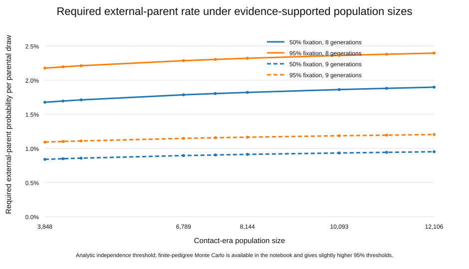

Finite-population Monte Carlo checks are included in the notebook. They are close to the analytic 50% thresholds and somewhat higher for the 95% target because pedigree states are correlated.

### Evidence-envelope propagation

The default envelope propagates a 26-30 year generation interval, the 11,960-12,890 BP land-bridge bracket, the nine published contact-era population outputs, an 11 ka debate founder date, and a 1797 contact marker.

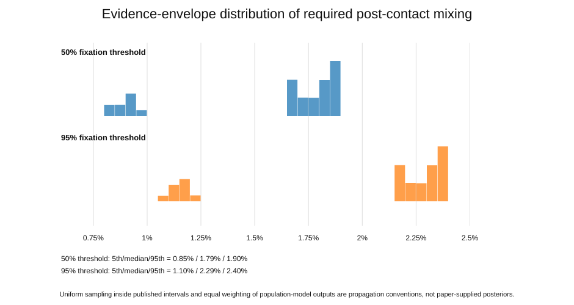

Uniform sampling within published numerical intervals and equal weighting of published population-model outputs are **Model 10 propagation conventions, not posterior distributions supplied by the papers**.

The threshold distribution is strongly split between 8-generation and 9-generation contact windows. One extra generation has a large effect:



### Demographic-collapse sensitivity

The early-contact period involved severe population decline. Model 10 therefore compares a constant population with a deliberately simplified bottleneck trajectory.

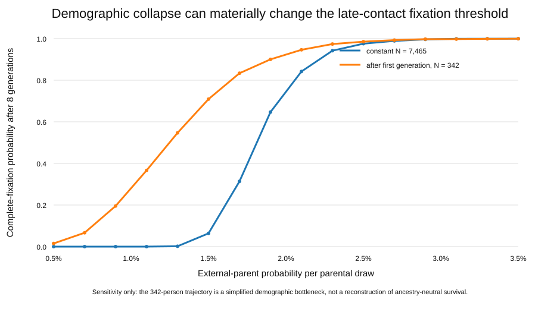

The bottleneck can materially lower the mixing rate required for genealogical fixation in the toy model. This is **sensitivity only**, because historical survival, movement, and reproduction were not ancestry-neutral random processes.

### What Model 10 establishes

It identifies the chronology supported by the direct evidence envelope, propagates published uncertainty, and calculates the post-contact reproductive mixing that would be required under explicitly favorable assumptions.

It does **not** provide a posterior probability that the proposed founders became universal ancestors. The critical Tasmania-specific reproductive-mixing rate remains unmeasured by the evidence reviewed here.

Primary references:

- P. Moorjani et al. (2016), *A genetic method for dating ancient genomes provides a direct estimate of human generation interval in the last 45,000 years*, PNAS 113, 5652-5657.
- R. J. Wang et al. (2023), *Human generation times across the past 250,000 years*, Science Advances 9, eabm7047.
- R. S. Fuller et al. (2023), *The archaeology of orality: Dating Tasmanian Aboriginal oral traditions to the Late Pleistocene*, Journal of Archaeological Science.
- R. Byard and H. Maxwell-Stewart (2024), *Estimating early contact-era populations for lutruwita (Tasmania)*, Asia-Pacific Economic History Review 64, 72-93.
- A.-S. Malaspinas et al. (2016), *A genomic history of Aboriginal Australia*, Nature 538, 207-214.
- E. Willerslev and D. J. Meltzer (2021), *Peopling of the Americas as inferred from ancient genomics*, Nature 594, 356-364.

### Judgment on the claim

**Historically unresolved with the evidence currently encoded in the repository.** Model 10 sharpens the chronology: the evidence-supported generation interval places an 11 ka founder about **367-423 generations** in the past, while the direct Bassian land-bridge bracket places geographic closure before that founder insertion. Using the published contact-era population-model set, the approximate external-parent rate required after contact is:

- **8 generations:** 1.68-1.90% per parental draw for a 50% complete-fixation target, and 2.18-2.40% for a 95% target;
- **9 generations:** 0.84-0.95% for a 50% target, and 1.09-1.20% for a 95% target.

Those are required-rate thresholds under deliberately favorable assumptions, **not inferred historical rates**. The reviewed evidence does not currently provide a defensible Tasmania-specific per-generation reproductive-mixing estimate, so a historical probability for the universal-ancestor claim cannot be calculated from these data alone.

**What would satisfy or strongly disfavor the claim:** obtain a defensible demographic estimate of post-contact reproductive mixing. Rates consistently above the required threshold would make late genealogical fixation compatible with the model; rates substantially below it would make that route unlikely under the stated assumptions. Alternatively, evidence of an earlier reproductive bridge would change the chronology. Without one of those additions, assigning a numerical historical probability would be false precision.

## Model 11: empirical admixture versus genealogical spread

### Claim from the debate

**Speaker attribution:** Both speakers. Dr. Vahdati-Nasab points to the absence of a detectable migration/admixture signal as an objection; Mr. Kamkar replies that genealogical ancestry and genetic ancestry are different quantities.

Low or absent detectable European genetic admixture in an Indigenous population was raised as an objection to outside genealogical ancestry. The counterclaim is that **genetic ancestry and genealogical ancestry are not the same quantity**: a source lineage can spread through pedigrees even while its mean DNA contribution remains small.

[](https://colab.research.google.com/github/vafaei-ar/Evolution-Creation/blob/main/notebooks/11_admixture_genealogy.ipynb)

### Result

Model 11 explicitly separates expected source-DNA proportion from genealogical descendant status.

For a single **1% genetic-admixture pulse**, followed by neutral random mating and no later source input, the expected population mean source-DNA fraction remains about 1%. Genealogical descent spreads because a child is a descendant if either parent is.

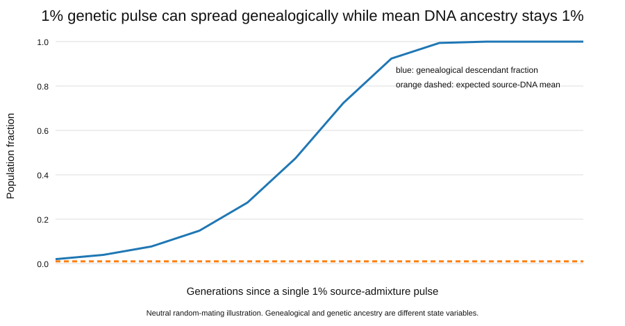

By generation 10, the deterministic genealogical descendant fraction exceeds **99.99%**. In a population of 1,000, the simple independent-final-state approximation gives a high probability of complete genealogical coverage; the Colab also provides finite-population Monte Carlo simulation because real pedigree states are correlated.

Published genomic work shows that admixture pulses and tract-length histories can often be dated on the scale of several to dozens of generations. For example, South American post-colonial admixture has been modeled at roughly 9-14 generations in one genome-wide study, and ancient Rapanui genomes carry about 10% Native American ancestry from a pre-European-contact event dated to approximately 1250-1430 CE.

### Judgment on the claim

**The inference "small genetic admixture means few genealogical descendants" is rejected.** Small mean genetic ancestry can coexist with nearly universal genealogical descent after enough intermarriage.

But the stronger reverse claim is also unsupported: **absence of detectable aggregate admixture does not itself prove that a particular outside genealogical ancestor existed.** Historical ancestry still requires a reproductive path and a defensible demographic history.

**What must be corrected to use the claim scientifically:** infer an admixture history rather than equating a present DNA percentage with a per-generation mating rate; distinguish individual genealogy from population mean DNA ancestry; and do not transfer an admixture estimate from one Indigenous population to another.

Primary references:

- *Genomic Insights into the Ancestry and Demographic History of South America* (PLOS Genetics, 2015), DOI 10.1371/journal.pgen.1005602.
- *Ancient Rapanui genomes reveal resilience and pre-European contact with the Americas* (Nature, 2024), DOI 10.1038/s41586-024-07881-4.
- Rasmussen et al. (2011), *An Aboriginal Australian genome reveals separate human dispersals into Asia*, Science, DOI 10.1126/science.1211177.

## Model 12: domestication versus biological appearance

### Claim from the debate

**Speaker attribution:** Mr. Kamkar connects the Qur'anic 'eight pairs' and the proposed Adam date to the apparent timing of livestock; Dr. Vahdati-Nasab replies that the relevant Neolithic transition is domestication, not the biological appearance of those lineages.

The debate connects the Qur'anic **"eight pairs"** of livestock with the proposed Adam period and treats the roughly Neolithic timing of several domestic animals as potentially supportive of a special-creation scenario.

[](https://colab.research.google.com/github/vafaei-ar/Evolution-Creation/blob/main/notebooks/12_domestication.ipynb)

### Result

Model 12 separates **domestication/management** from **biological lineage origin**.

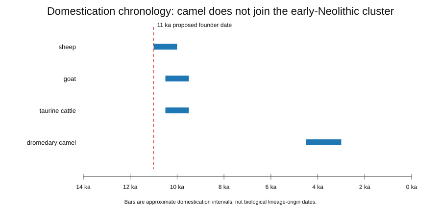

Using broad evidence intervals, sheep, goats, and taurine cattle have early-Neolithic domestication transitions around 9.5-11 ka. Dromedary camel domestication is substantially later, roughly in the second millennium BCE.

Under the model's simple uniform-within-evidence-interval calculation, the probability that **all four livestock domestication dates** fall inside a 9-12 ka window is **0%**, because the dromedary interval does not overlap that window. This is an interval-consistency calculation, not a posterior probability of creation.

More importantly, ancient DNA and zooarchaeology connect these domesticates to older wild populations. A 13 ka wild sheep paleogenome predates sheep domestication; goats derive from bezoar populations with genetic lineages much older than domestication; cattle derive from aurochs; and wild dromedaries existed before their late domestication.

### Judgment on the claim

**The claim is not supported if "appearance" means biological creation or species origin.** The dates near 10-11 ka are domestication transitions for several livestock, not evidence that those animal lineages first came into existence then. The dromedary is also chronologically inconsistent with an all-four 11 ka domestication cluster.

**What would need to be corrected for the stronger claim to hold:** the argument would need evidence that the relevant animal lineages were absent before the proposed date and appeared without pre-existing wild progenitors. The ancient-DNA and zooarchaeological evidence encoded here instead supports domestication from older wild populations.

Primary references:

- Frantz et al. (2020), *Animal domestication in the era of ancient genomics*, Nature Reviews Genetics.
- Yurtman et al. (2024), *The Population History of Domestic Sheep Revealed by Paleogenomes*, Molecular Biology and Evolution.
- Naderi et al. (2007), domestic goat mitochondrial diversity, PLOS ONE.
- Rossi et al. (2024), *The genomic natural history of the aurochs*, Nature.
- Almathen et al. (2016), *Ancient and modern DNA reveal dynamics of domestication and cross-continental dispersal of the dromedary*, PNAS.

## Model 13: population-genetic detectability of a specially inserted pair

### Claim from the debate

**Speaker attribution:** Mr. Kamkar advances a special-creation scenario in which Adam and Eve enter an already existing human population. Dr. Vahdati-Nasab raises the genetic question of how independently inserted humans would match the pre-existing human genetic lineage.

The special-creation scenario is partly defended as **genetically non-excludable**: a pair could appear within an existing human population around 11 ka, interbreed, and later become genealogical ancestors without modern genetics necessarily recovering an obvious "Adam and Eve" signature.

[](https://colab.research.google.com/github/vafaei-ar/Evolution-Creation/blob/main/notebooks/13_inserted_pair_detectability.ipynb)

### Result

Model 13 separates a **genetically ordinary insertion** from a **genetically distinctive insertion**.

If the pair is genetically drawn from the same distribution as surrounding humans and carries no unique identifying feature, there is no unique marker for genetics to detect by construction.

If the pair carries private neutral variants, those variants have a stochastic fate. In an illustrative Wright-Fisher population with effective size 10,000, two initial copies of one private marker, and about 400 generations, Monte Carlo simulations put survival of a single neutral marker on the order of **1%**. Most individual private variants are therefore lost.

But many distinctive variants change the inference:

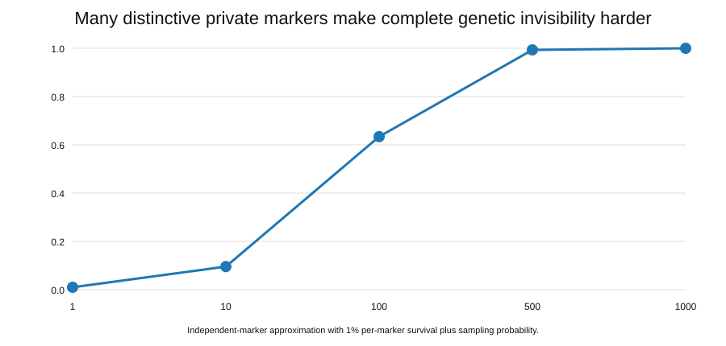

With an illustrative 1% per-marker probability of surviving and being sampled, the independent-marker approximation gives about **63%** probability of detecting at least one of 100 distinctive markers and **>99%** for 500. Real variants are linked, so this is a sensitivity calculation rather than a genome-wide likelihood.

### Judgment on the claim

**The weak claim is supported: genetics need not detect such a pair.** A genetically ordinary pair has no unique genetic test, and a small number of neutral private markers can disappear by drift.

**The strong claim "genetics could never detect them" is not supported.** If a specially created pair was genomically unusual in many independent ways, complete disappearance of every distinctive signal becomes progressively less plausible.

**What must be corrected for the claim to be scientifically testable:** specify the predicted genetic difference between the pair and contemporaneous humans, effective population structure, reproductive success, selection on distinctive alleles, and the sampling/detection criterion. Without a predicted genetic difference, non-detection is not positive evidence for the event.

## Model 14: agency inference from artifacts versus cosmic fine-tuning

### Claim from the debate

**Speaker attribution:** Mr. Kamkar explicitly makes the analogy from archaeologists recognizing intentional stone-tool patterning to an agency inference from cosmic order and fine-tuning.

The debate argues that patterned stone tools justify an inference to **agency**, and then extends that reasoning to cosmic order, regularity, and fine-tuning: if archaeologists reject a random natural origin for carefully modified stones, analogous patterns in the universe may support a cosmic agency inference.

[](https://colab.research.google.com/github/vafaei-ar/Evolution-Creation/blob/main/notebooks/14_agency_fine_tuning.ipynb)

### Result

Model 14 writes both arguments in the same Bayesian form:

```math
\text{posterior odds}
=
\text{prior odds}
\times
\frac{P(E\mid H_1)}{P(E\mid H_0)}.
```

That establishes a genuine logical analogy. But it does **not** establish equal evidential strength.

Archaeological artifact classification can be experimentally calibrated. Candidate flakes can be compared with known human-knapped material, natural geofacts, fracture experiments, microwear, and site context. The resulting inference can therefore have empirically estimable false-positive and true-positive behavior.

For illustration only, a synthetic classifier with 95% true-positive and 1% false-positive rates has likelihood ratio 95. Even then, a 1% prior becomes only about **49% posterior**, whereas a 10% prior becomes about **91%**.

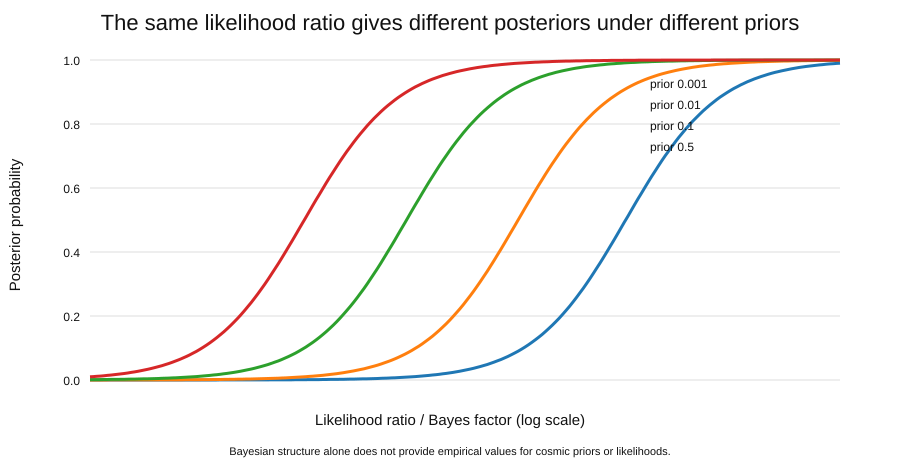

Fine-tuning arguments can also be represented with likelihoods and priors, but there is no experimental ensemble of created and uncreated universes from which those quantities can be calibrated. The contemporary philosophical literature also disputes the relevant probability measures, design likelihood, alternative hypotheses, and observer-selection effects.

### Judgment on the claim

**The analogy is valid at the level of probabilistic logic, but it does not transfer the calibrated strength of an archaeological agency inference to cosmology.** Evidence supports agency when the observed pattern is demonstrably more expected under agency than under specified alternatives.

For stone artifacts, experimental controls can help estimate that comparison. For cosmic fine-tuning, the key probabilities remain model- and philosophy-dependent. Therefore the stronger claim that fine-tuning makes agency scientifically unavoidable is **not established by the stone-tool analogy alone**.

**What would need to be specified for a quantitative fine-tuning claim:** the competing hypotheses; a measure over physical possibilities; (P(E\mid\text{design})); (P(E\mid\text{non-design alternatives})); observer-selection effects; prior odds or a prior-robust argument; and sensitivity to new-physics and multiverse alternatives.

Primary references:

- Lubinski, Terry & McCutcheon (2014), *Comparative methods for distinguishing flakes from geofacts*, Journal of Archaeological Science 52:308-320.
- Stanford Encyclopedia of Philosophy, *Fine-Tuning*, substantive revision 2026.

## Model 15: evolution of cooperation, punishment, conformity, and moral norms

### Claims from the debate

**Speaker attribution:** Two claims from different parts of the exchange. Dr. Vahdati-Nasab advances the descriptive evolutionary/conformity account, including the approximate '90% middle' illustration; Mr. Kamkar raises and endorses the objection that group acceptance cannot by itself define moral truth.

The morality discussion contains two separable claims.

One is descriptive: cooperation, punishment, sensitivity to group norms, and flexible conformity can be shaped by evolutionary and cultural pressures. The debate even proposes a broad distribution in which many people adapt their behavior to the prevailing social norm.

The second is a philosophical objection: **group acceptance cannot define moral truth**, because conformity can sometimes require participation in behavior we independently judge immoral.

[](https://colab.research.google.com/github/vafaei-ar/Evolution-Creation/blob/main/notebooks/15_moral_evolution.ipynb)

### Result

Model 15 combines a simple payoff pressure with conformist cultural transmission.

Cooperation is costly. Defectors can face punishment proportional to the cooperative/punishing fraction. Conformity adds a frequency-dependent advantage to whichever behavior is already common.

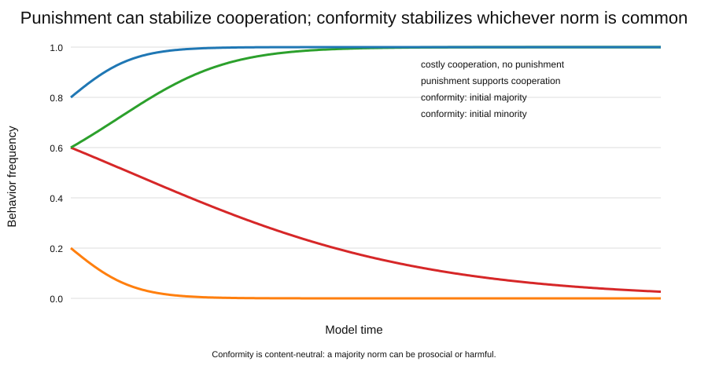

The model reproduces three well-established qualitative results:

- costly cooperation can decline when no supporting mechanism exists;
- sufficiently strong punishment can stabilize high cooperation;
- conformity creates positive frequency dependence, pushing majority behaviors toward greater prevalence.

The last result is morally content-neutral. If the majority behavior is cooperative, conformity can stabilize cooperation. If the majority behavior is cruel, discriminatory, dishonest, or otherwise harmful, the same conformity mechanism can stabilize that norm.

Experimental work by Fehr and Gächter found that cooperation flourished when costly punishment was available and deteriorated when punishment was excluded. Nowak reviews multiple mechanisms by which cooperation can evolve. Boyd and colleagues showed theoretically that even weak conformist transmission can stabilize costly norm enforcement under specified cultural-evolutionary conditions.

### Judgment on the claims

**The descriptive evolutionary claim is supported in a qualified sense.** Evolutionary and cultural mechanisms can explain the emergence and maintenance of cooperation, norm following, punishment, and conditional adaptation to group behavior.

The model does **not** support a literal universal claim that a particular fixed percentage such as "90%" of humans belongs to one conformist psychological category. That number requires an operational definition and empirical population data.

**The reduction of morality to conformity or reproductive success is not supported.** Model 15 directly demonstrates the problem: conformity is blind to moral content. It can stabilize a good norm or a bad norm with identical mathematics.

Thus an evolutionary explanation of moral psychology does not logically establish objective moral truth, and it does not disprove objective moral truth either. It explains behavior and norm transmission, not the validity of an "ought."

**What would be required for the stronger normative claim:** an additional metaethical or normative premise connecting facts about fitness, welfare, rationality, flourishing, rights, divine command, or some other criterion to moral truth. Population dynamics alone cannot supply that bridge.

Primary references:

- Nowak (2006), *Five rules for the evolution of cooperation*, Science 314:1560-1563.
- Fehr & Gächter (2002), *Altruistic punishment in humans*, Nature 415:137-140.
- Boyd, Gintis, Bowles & Richerson (2001), *Why people punish defectors. Weak conformist transmission can stabilize costly enforcement of norms in cooperative dilemmas*, Journal of Theoretical Biology 208:89-109.

## Repository structure

~~~text
src/evolution_creation/   reusable model code
notebooks/                interactive Colab notebooks
scripts/                  reproducible output-generation scripts
tests/                    unit tests
docs/                     assumptions and interpretation
figures/                  generated outputs shown in this README
~~~

## Run locally

~~~bash
python -m pip install -e ".[dev]"
pytest
python scripts/generate_figures.py
python scripts/generate_model02_outputs.py
python scripts/generate_model03_outputs.py
python scripts/generate_model04_outputs.py
python scripts/generate_model05_outputs.py
python scripts/generate_model06_outputs.py
python scripts/generate_model07_outputs.py
python scripts/generate_model08_outputs.py
python scripts/generate_model09_outputs.py
python scripts/generate_model10_outputs.py
python scripts/generate_model11_outputs.py
python scripts/generate_model12_outputs.py
python scripts/generate_model13_outputs.py
python scripts/generate_model14_outputs.py
python scripts/generate_model15_outputs.py
python scripts/generate_continental_explorer_preview.py
~~~

## Modeling roadmap

1. Founder ancestry in a single panmictic population: implemented
2. Multiple demes, migration, and fixed barriers: implemented
3. Time-varying barriers and historically changing connectivity: implemented
4. Time-varying population size, carrying capacity, bottlenecks, and overlapping ancestry: implemented
5. Endogamy and assortative mating: implemented
6. Genealogical MRCA and identical-ancestors behavior: implemented
7. Chromosomes, recombination, and loss of detectable founder DNA: implemented
8. Population-scale pedigree + chromosome integration: implemented
9. Historically constrained migration, isolation, endogamy, demography, and founder scenarios: implemented
10. Evidence-calibrated chronology, population uncertainty, and required mixing thresholds: implemented
11. Genetic admixture versus genealogical spread: implemented
12. Domestication timing versus biological species appearance: implemented
13. Population-genetic detectability of a specially inserted pair: implemented
14. Agency inference: artifacts versus fine-tuning: implemented
15. Evolution of cooperation, punishment, conformity, and moral behavior: implemented

**Interactive synthesis:** continental founder-spread explorer with editable populations, migration matrix, mixing, timing, animated map, and genealogy-vs-DNA display: implemented.

## Computational modeling endpoint

Models 01-15 now cover the main claims from this debate that can be meaningfully formalized without pretending that philosophical or theological propositions are themselves numerical parameters.

Further work should primarily **refine evidence and assumptions** rather than add more toy models: better archaeological chronology, population-specific admixture/demographic estimates, richer genomic simulations, and explicit philosophical premises where the question is normative rather than empirical.

## Interpretation rule

Every model should separate:

**Assumptions → mechanism → output → interpretation → what the model does not establish**

A simulation can demonstrate compatibility under assumptions. It cannot by itself establish that a historical or theological event occurred.
