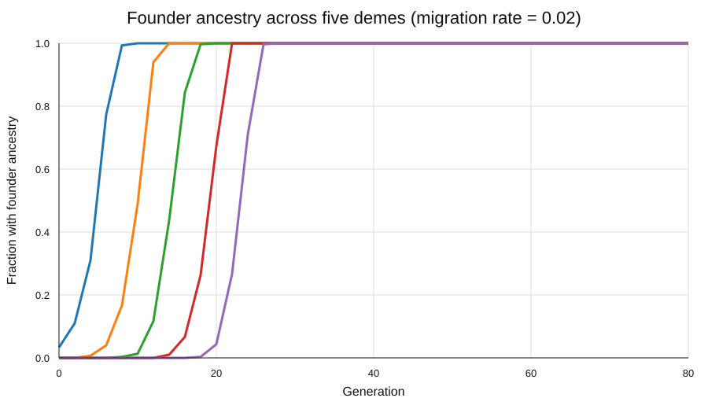
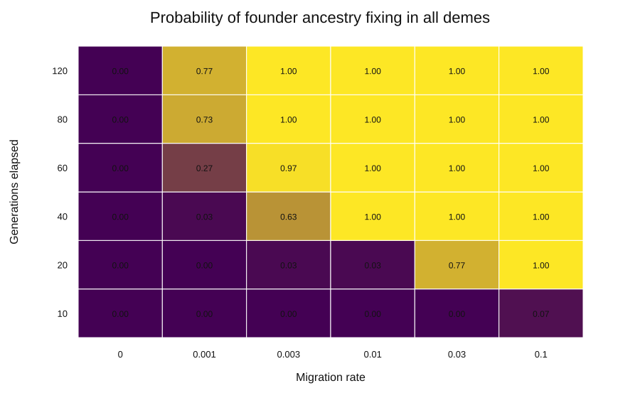
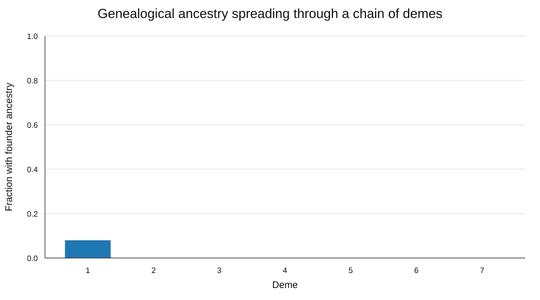
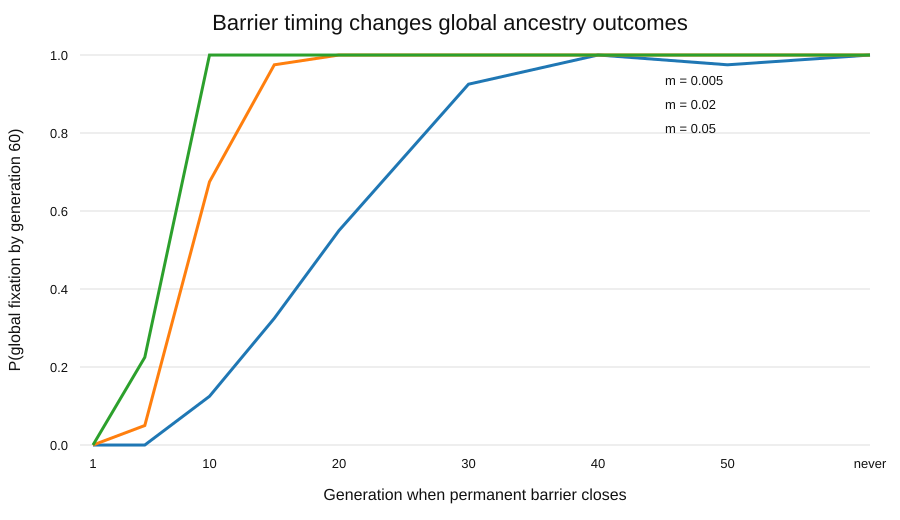
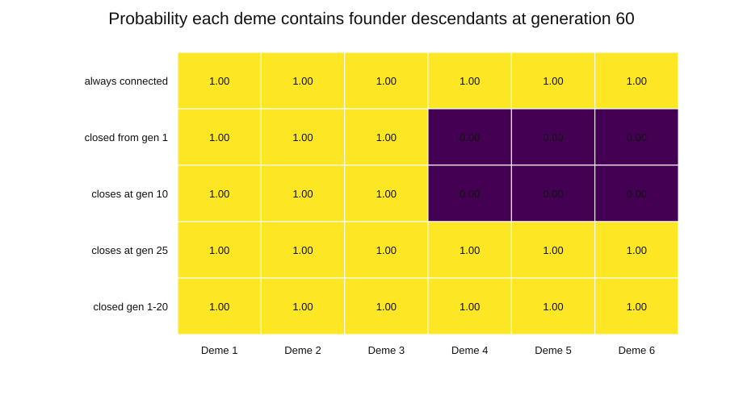
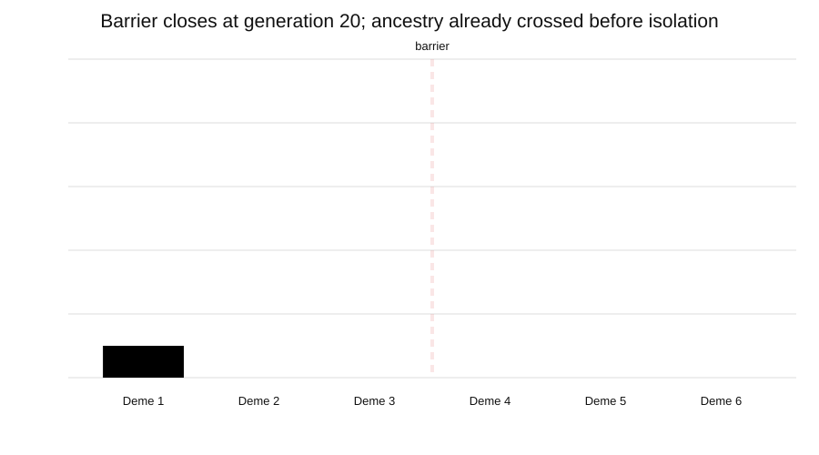
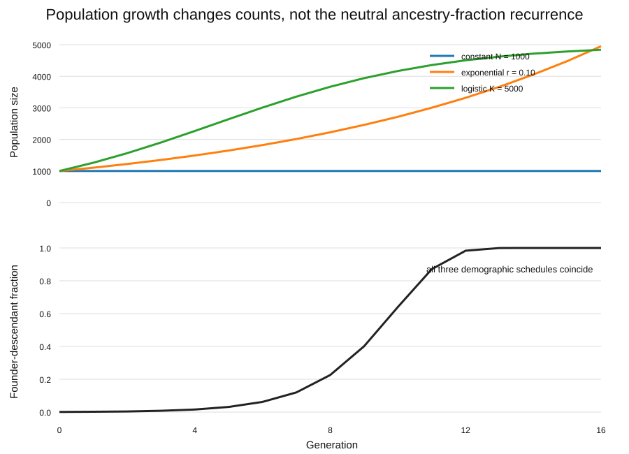
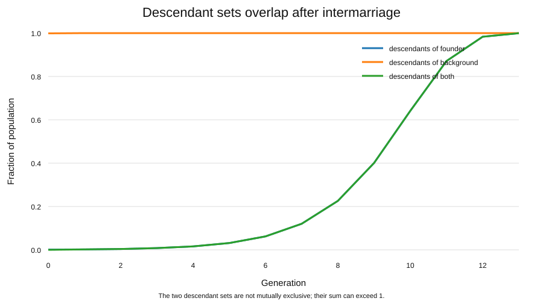
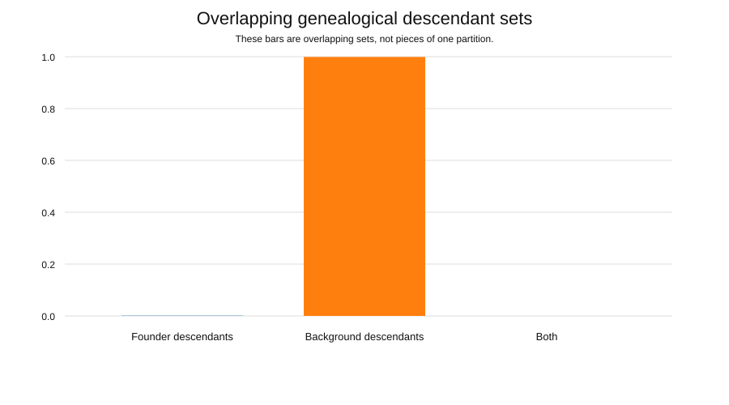

# Evolution-Creation

A reproducible Python project for testing quantitative claims raised in a debate about evolution, creation, human genealogy, migration, and genetic ancestry.

The project does **not** assume that a theological or historical claim is true. Each model is framed conditionally:

> Given a stated set of assumptions, what follows mathematically or computationally?

## Model 01: spread of a genealogical founder

The baseline asks:

> If one individual enters a finite, completely mixed population and reproduces within it, how does that individual's genealogical ancestry spread through later generations?

It assumes fixed population size, non-overlapping generations, two parents per child, random mating, no geography, no migration, no selection, and no genetics.

Under the infinite-population deterministic approximation:

$$
f_{t+1}=1-(1-f_t)^2.
$$

The stochastic simulation samples parents explicitly, so rare founder lineages can disappear by chance.

## Model 02: structured populations and migration

Model 02 removes the strongest unrealistic assumption from Model 01: complete mixing.

The population is divided into demes. For a child born in deme $i$, the migration matrix entry $M_{ij}$ is the probability that a parent is sampled from source deme $j$. This is an abstraction of parental-source mixing or gene flow.

### Example trajectory

The figure below uses five equal demes in a line, one founder population at the left edge, and a total nearest-neighbor migration rate of 0.02 per parental draw.

The parameter values above are illustrative. They are **not** estimates of ancient human migration.

### Sensitivity to migration and elapsed time

The next figure estimates the probability that founder ancestry has fixed in all four demes by the stated generation. It uses 30 stochastic replicates per cell.

At migration rate zero, the founder lineage cannot cross between demes. With nonzero connectivity, elapsed time and migration rate jointly control whether the lineage spreads through the entire system.

### Animated ancestry front

The generated SVG below animates one stochastic run across seven demes.

Model 02 also has a hard-barrier control. A permanent barrier makes the migration matrix block-disconnected. If the founder starts on one side, ancestry cannot reach the other side regardless of how many generations pass.

## Model 03: time-varying connectivity

Model 03 allows migration barriers to appear or disappear over time.

This distinction is important:

- a population isolated from the start cannot receive founder ancestry across the barrier;
- a population that becomes isolated later may already contain that ancestry;
- reopening a route can restart spread after a period of isolation.

### When does isolation begin?

The figure below varies the generation when a permanent barrier appears. The final-generation fixation probability changes strongly with both migration rate and barrier timing.

These are small illustrative simulations. The plotted probabilities include Monte Carlo error and are not historical estimates.

### Same barrier, different histories

The barrier in these scenarios is between Deme 3 and Deme 4.

A barrier present from generation 1 keeps the right component free of founder ancestry. Closing the same barrier later can give a completely different result because ancestry may already have crossed.

### Animation: isolation after ancestry crosses

In this run, the barrier closes at generation 20. Founder ancestry has already entered Deme 4. After isolation, ancestry continues spreading inside the now-separated right component.

## Model 04: population growth, carrying capacity, and overlapping ancestry

Model 04 addresses a common intuition trap: treating "descendants of the founder" and "descendants of everyone else" as two disjoint populations that each grow exponentially.

After intermarriage, those descendant sets overlap. A person can be descended from both the founder and members of the original background population.

Under neutral random mating,

$
f_{t+1}=1-(1-f_t)^2
$

still governs the expected founder-descendant fraction even when total population size changes. Demography changes absolute descendant counts and finite-population extinction risk, but not this infinite-population neutral fraction recurrence.

### Growth and carrying capacity

The upper panel below compares constant, exponential, and logistic population-size schedules. The lower panel shows the same expected genealogical ancestry fraction for all three because they begin with the same founder fraction.

### Why two exponential lineages are the wrong picture

The next figure separately tracks descendants of the founder group, descendants of the original background group, and people descended from both.

Once intermarriage occurs, "founder descendants" and "background descendants" are overlapping sets, not mutually exclusive clans.

### Animated overlap

The notebook also lets you introduce logistic carrying capacity, temporary bottlenecks, and a relative reproductive-weight sensitivity parameter. These are conceptual experiments, not estimates of prehistoric demography.

## Repository structure

~~~text
src/evolution_creation/   reusable model code
notebooks/                interactive Colab notebooks
scripts/                  reproducible output-generation scripts
tests/                    unit tests
docs/                     assumptions and interpretation
figures/                  generated outputs shown in this README
~~~

## Run locally

~~~bash
python -m pip install -e ".[dev]"
pytest
python scripts/generate_figures.py
python scripts/generate_model02_outputs.py
python scripts/generate_model03_outputs.py
python scripts/generate_model04_outputs.py
~~~

## Modeling roadmap

1. Founder ancestry in a single panmictic population: implemented
2. Multiple demes, migration, and fixed barriers: implemented
3. Time-varying barriers and historically changing connectivity: implemented
4. Time-varying population size, carrying capacity, bottlenecks, and overlapping ancestry: implemented
5. Endogamy and assortative mating
6. Genealogical MRCA and identical-ancestors behavior
7. Chromosomes, recombination, and loss of detectable founder DNA
8. Historically constrained scenarios

## Interpretation rule

Every model should separate:

**Assumptions → mechanism → output → interpretation → what the model does not establish**

A simulation can demonstrate compatibility under assumptions. It cannot by itself establish that a historical or theological event occurred.
